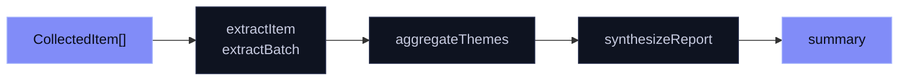
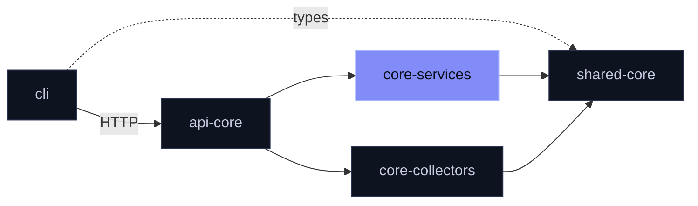

<div align="center">

# `@mira/core-services`

**From raw discussion to ranked themes.**

LLM · extraction · clustering · report · queue · Postgres · OpenViking

[](https://www.npmjs.com/package/@mira/core-services)
[](./LICENSE)

</div>

<br>

The service layer of Mira's open core. It turns collected items into structured pain points, clusters them into themes and writes a summary — plus the queue, LLM, database and memory-store plumbing around that work.

## Install

```sh
npm install @mira/core-services
```

## The analysis path



```ts
import { extractItem, aggregateThemes, synthesizeReport } from '@mira/core-services'

const pairs = []
for (const item of items) {
  const r = await extractItem(item)
  if (r.ok) pairs.push({ item, extraction: r.value })
}

const themes = await aggregateThemes(pairs)
if (!themes.ok) throw themes.error

const report = await synthesizeReport(query, {
  painPoints: themes.value,
  competitorWeaknesses: [],
  emergingGaps: [],
})
```

> [!IMPORTANT]
> **Bring your own prompts.** No prompt files ship in any public Mira repository. Put `extract_pain_points.txt` and `synthesize_report.txt` in a directory and point `MIRA_PROMPTS_DIR` at it.

## What's inside

| Module | Exports | Fails by |
|:--|:--|:--|
| LLM | `callLLM`, `LLMResponseError`, `resolveLLMConfig` | throwing |
| Analysis | `extractItem`, `extractBatch`, `aggregateThemes`, `synthesizeReport`, `stripFences` | `Result` |
| Queue | `orchestrator` (`enqueue`, `getJob`, `listJobs`) | throwing |
| Database | `query`, `closePool` | `Result` |
| Cache | `readAnalysisCache`, `writeAnalysisCache`, key helpers | `Result` on write |
| Memory | `openVikingClient` (`addResource`, `find`) | throwing |
| Utility | `mapWithConcurrency` · the `usage-scope` recorder | — |

**Design choices worth knowing**

- **Any OpenAI-compatible endpoint.** Provider-neutral by design.
- **No silent garbage.** Empty, choiceless and truncated LLM replies are errors.
- **One bad reply never sinks a batch.** Batch extraction tags failures per item.
- **Embeddings optional.** Theme clustering uses Jina embeddings, or groups by identical key quote when skipped.
- **Fails fast without Redis**, so callers can answer `503` instead of hanging.

> [!WARNING]
> The analysis cache needs an `llm_analysis_cache` table. No shipped migration creates it — create it yourself first.

## Where it sits



<details>
<summary><b>Configuration</b></summary>

<br>

| Variable | For |
|:--|:--|
| `LLM_API_KEY` · `LLM_BASE_URL` · `LLM_MODEL` | LLM provider |
| `LLM_DISABLE_THINKING` | Force thinking mode on or off |
| `JINA_API_KEY` | Embedding-based clustering |
| `REDIS_URL` | Job queue |
| `DATABASE_URL` | Postgres |
| `MIRA_PROMPTS_DIR` | Your prompt files |
| `MIRA_LLM_CACHE_TTL_DAYS` | Analysis cache lifetime |
| `OPENVIKING_URL` · `OPENVIKING_API_KEY` | Memory store |

Legacy `OPENAI_*` and `DEEPSEEK_*` names are still read, with a one-time warning.

</details>

<details>
<summary><b>Build from source</b></summary>

<br>

Clone next to `shared` in a pnpm workspace, then:

```sh
pnpm install && pnpm build
```

</details>

<br>

<div align="center">
<sub>
Part of <a href="https://github.com/mira-js">Mira's open core</a> ·
<a href="./LICENSE">AGPL-3.0-only</a> ·
<a href="https://github.com/mira-js/.github/blob/main/CONTRIBUTING.md">Contributing</a> (<a href="https://github.com/mira-js/.github/blob/main/CLA.md">CLA</a>) ·
<a href="https://github.com/mira-js/services/security/advisories/new">Report a vulnerability</a>
<br>
Copyright (C) 2026 Fernando Nieto Pallares
</sub>
</div>
